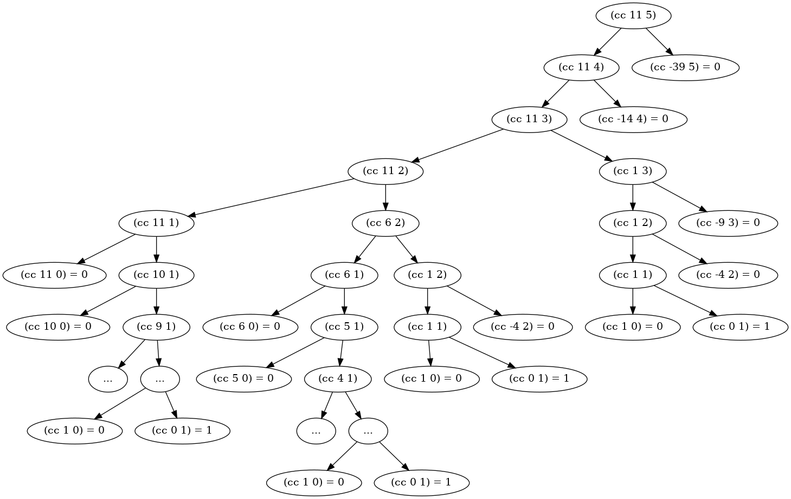

- The tree illustrating the process generated by the count-change procedure

- the orders of growth of the space is $\Theta(n^2)$ (the number of steps used by this process as the amount to be changed increases)
- the orders of growth of the time is $\Theta(a^n)$ (see scheme wiki)
